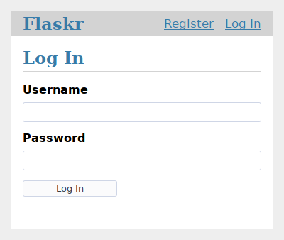

base.html页面
===

# 测试函数

为了查看页面效果，可以编写一个函数查看访问 base.html 页面。

flask-tutorial/flaskr/__init__.py：

```python
import os
from flask import Flask
from flask import render_template

def create_app(test_config=None):
	# 为了排版方便，前面的代码省略
	
    # 测试 base.html 页面
    @app.route('/base')
    def base():
        return render_template('base.html')

    return app
```

# 启动项目

在 Pycharm 的 Terminal 逐个运行如下命令：

```bash
$ export FLASK_APP=flaskr
$ export FLASK_ENV=development
$ flask run
```


# 页面分析



- 最外面一层

  （1）最外面一层，这里指 <html>。

  （2）“灰色”有很多种，这里使用  `background: #eee;`。

- 白色层

  （1）白色层，这里指 <body>。

  （2）“白色”也有很多种，这里使用  `ackground: white;`。

  （3）间距的设置： <body>  默认是填充  <html> 的，这里给 <body> 设置一个宽度，然后设置水平居中。

- “导航栏”

  （1）背景色是灰色，这里使用 Flask 官方教程中的 `background: lightgray`。

- Flaskr

  （1）蓝色。这里使用 ` color: #377ba8`;

- Register 和 Log in

  （1）`Flaskr`的 <h1></h1> 是块级元素，<ul> 也是。两者要想并列，那么可以使用弹性布局。

  （2）<a></a>标签的颜色，间距，

# 参考资料

[1]url_for()函数：  [url_for()](https://flask.palletsprojects.com/en/1.1.x/api/#flask.url_for)

